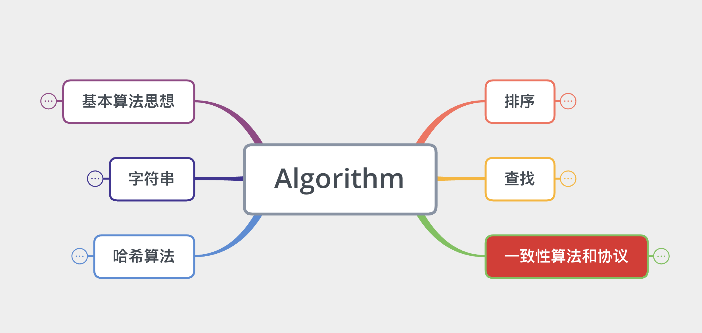
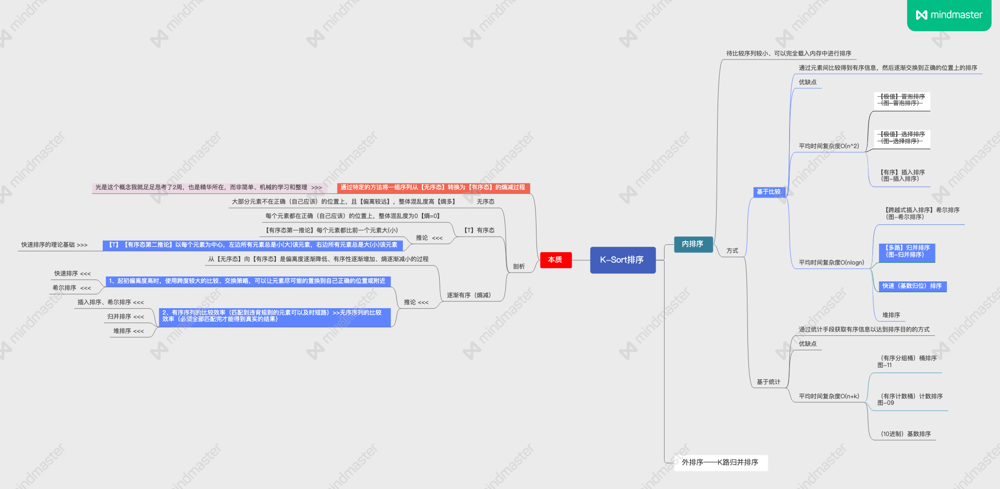
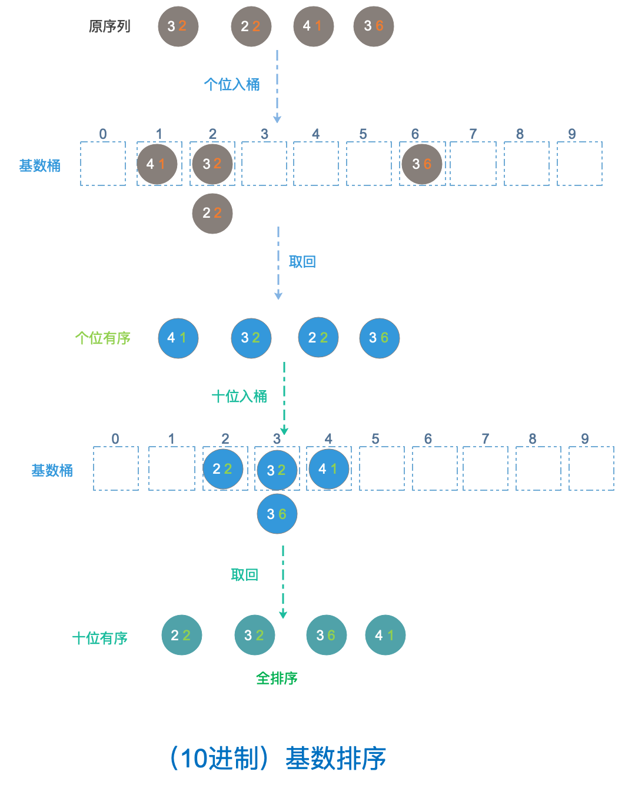
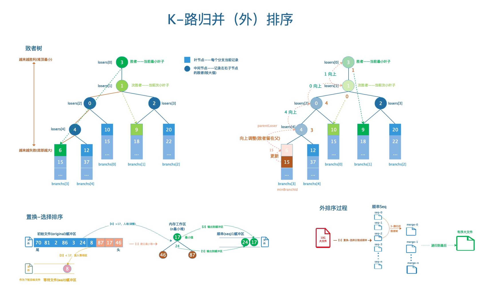

    
# Awesome Algorithm 解构算法
--
以独特的思考、精准的文字、直观的例图剖析编程中最常用、最抽象、最复杂的算法、数据结构、并发编程、一致性安全等问题。

[完整脑图](http://kjeek.com/algo/awesome-algorithm/)

### 红黑树

### k-sort 图解排序算法

- [脑图](https://mm.edrawsoft.cn/wx.html?work_id=83385)

- [例图](https://mm.edrawsoft.cn/wx.html?work_id=83385)

### k-路归并（外）排序

